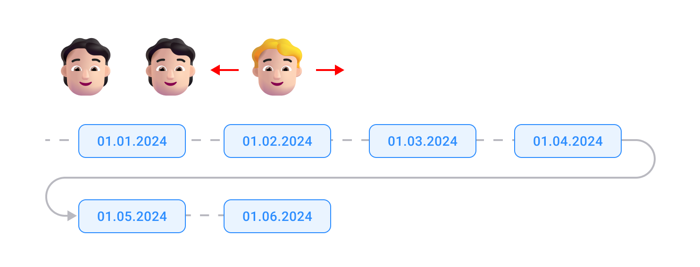
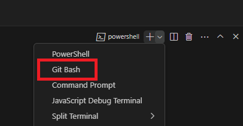

<div style="display: flex; align-items: center;">
    
    <h1 style="font-size: 6em; margin-left: 30px; display: flex; align-items: center; vertical-align: baseline;">Surgery Quota Scheduler</h1>
</div>


<div>
  


</div>
The Multi-Agent Reinforcement Learning (MARL) environment's Surgery Quota Scheduler is a strategic game that revolves around optimizing surgery schedules. Agents, representing surgeries, must navigate a limited capacity schedule, balancing urgency, complexity, and data completeness to maximize rewards. They can move through time slots, hold positions, or recall their quotes, all while contending with partial visibility of the schedule. The goal is to efficiently allocate surgeries across time slots without overcrowding, and the game concludes once a predetermined number of steps are taken. This system aims to simulate the decision-making process in surgical scheduling, emphasizing the importance of flexibility and foresight.

<h1 style="text-align: center;width: 120%">
    
</h1>

<h1>Table of contents</h1>

 - [Environment usage](#Environment-usage)
 - [Environment Description](#environment-description)
 - [Calculated parameters](#calculated-parameters)
 - [Rewards](#rewards)
 - [Actions](#actions)
 - [Observations](#observations)
 - [Termination rule](#termination-rule)

## Environment usage
To run the model training process, use a bash script as follows:
```
./run.sh
```
Be careful, this command will do everything for you, but the code execution will take a very long time (up to several days on some PC configurations).

For the command to work you need to use it in the Git Bash terminal. You can find the required terminal in Visual Studio Code, on the terminal bar:




In order to quickly reproduce the results of numerical experiments follow these steps:
1) Install Python 3.12
2) Create a virtual environment:
    ```
    python -m venv venv
    ```
3) Activate the virtual environment

    For Windows/Linux, go to the ```env/Scripts``` folder and run the script in the Powershell console
    ```
    ./activate
    ```
    If you use the Windows integrated command console instead of Powershell the activation will look like this:
    ```
    .\activate
    ```
    On a Mac, the procedure will be similar, but the directory you need will be at ``env/bin``.
    
    After that, go back to the directory where the files ```requirements.txt``` and ```fast_predict.py``` are located.

4) Install the necessary dependencies:
    ```
   python -m pip install -r requirements.txt
   ```

## Environment Description

**Environment Parameters**

1. **Number of Agents (N)**: 28 agents participate in this environment.
2. **Number of Days (N_DAYS)**: The setup includes 14 days during which agents interact.
3. **Number of Iterations (NUM_ITERS)**: Calculated by the formula \(\frac{N^2}{N_{DAYS} \cdot C}\), where \(C = 4\). This determines the total number of steps in an episode.
4. **Moves**: 
- Move forward in time: $0$;
- Move back in time: $1$;
- Hold the position: $2$;
- Possible agent movements are encoded as $\( \{0 \rightarrow +1, 1 \rightarrow -1, 2 \rightarrow 0\} \)$.
5. **Base Reward Parameter (b)**: Set to 0.2.

**Agents**

Each agent is characterized by the following parameters:
- **Name**: Randomly generated from a list of popular names and surnames.
- **Urgency**: Takes values from the set $\(\{1, 2, 3\}\)$.
- **Completeness**: Takes values from the set $\(\{0, 1\}\)$.
- **Complexity**: Takes values from the set $\(\{0, 1\}\)$.
- **Position**: Agent's position within the range $\(\{0, 1, ..., 13\}\)$.
- **Coefficient (k)**: Calculated as $\ k = (\text{complexity} + (1 - \text{completeness})) \times \text{urgency} \$.
- **Mutation Rate**: Ranges from 0 to 1.

**State and Action Spaces**

- **Observation space**: Discrete space represented by a set of size 7 $(\(\mathbb{O} = Discrete(7)\))$.
- **Action space**: Also discrete, containing 3 possible actions $(\(\mathbb{A} = Discrete(3)\))$.

Actions of each agent are denoted as $\(a_i \in A\)$, where $\(A\)$ is the set of all possible actions.

**Reward Function**

An agent's reward is determined by its position and the chosen action according to the following formula:

$\text{reward}(a, p, s, k, \text{action}) = \begin{cases} b \cdot k - (s[p] - 1) \cdot b & \text{if action} = 0 \\ - b \cdot k - (s[p] - 2) \cdot b & \text{if action} = 1 \\ - (s[p] - 4) \cdot b & \text{if action} = 2 \end{cases}$


where $\(s[p]\)$ is the number of agents at position $\(p\)$, and $\(b = 0.2\)$.

**Termination Rules**

Environment termination occurs under the following conditions:
- If the number of iterations $(\(\text{NUMMOVES}\))$ reaches $\(NUMITERS - 1\)$ and more than 80% of agents choose action $\(2\)$:

$\text{termination} = \text{True}, \quad \text{if } \frac{\sum \text{actions} = 2}{N} \geq 0.8$, $\text{False, otherwise}$


- If the number of iterations reaches $(2 \times NUMITERS - 1\)$:

$\text{truncation} = \begin{cases} \text{True} & \text{if } \text{num_moves} = 2 \times NUM\_ITERS - 1  \text{False} & \text{otherwise} \end{cases}\$

**Environment Dynamics**

1. **Position Update**: Agent's position changes according to the chosen action. The position is bounded within the range \([0, N_{DAYS}-1]\).
2. **Mutation Level**: If an agent's position exceeds half of the days (\(N_{DAYS}/2\)):
    - Mutation level increases if the action is 0.
    - Mutation level decreases if the action is 1.
3. **Agent Parameter Changes**: Depending on the mutation level, urgency, completeness, and complexity parameters of agents may change.

**Environment Initialization**

Upon environment reset, agent parameters and positions are initialized randomly within specified ranges. Initial observations and information are updated according to the current environment state.

### State Space and Combinations

The environment state space is discrete and defined by the set of parameters of all agents. Each agent can be assigned to one of the 14 days, resulting in a large number of possible system configurations.

Considering possible combinations of 4 agents over 14 days, the number of combinations can be expressed using the binomial coefficient:

Therefore, in this environment, it is possible to have 20475 different combinations of agents over 4 days out of 14. These combinations create a rich state space, allowing modeling of diverse scenarios and strategies.


## Hyperparameters (by default)
- Baseline reward: $b=0.2$;
- Number of agents: $N=12$ (by the number of unique combinations of the following parameters);
  
    Each agent consists of a set of these parameters inherent to it:
    - Complexity: 0 or 1, where 0 - an easy task, 1 - a hard one;
    - Completeness: 0 or 1, where 0 - an insufficient data, 1 - a fully covered case;
    - Urgency: ascending from 1 (lowest priority) to 3 (highest priority);
- Time slot capacity: $C=4$;

## Calculated parameters
- Number of steps: $S=N^2/C$;
- Scaling factor: $k=(Complexity+(1 - Completeness))*Urgency$;

## Rewards
- Reschedule a quote forward 1 time step in future: $r=-b*k$;
- Reschedule a quote back 1 time step in time: $r=+b*k$;
- Hold the position: 
  - if $n \leq C$, $r=(C-n)*b$;
  - if $n>C$, $r=-(n-C)*b$;
  where $n$ - current number of agents in focal time slot
- If more than $C$ agents in one time slot and it is the end of the episode: $r=-10$;
- If every agent placed in time slot with no more than 3 other agents at the end of the episode $r=+10$;

## Actions
- Move forward in time;
- Move back in time;
- Hold the position;
- Recall your quote with chance equals to $P=0.05$ (may randomly occur at any time step);

## Observations
At each step, the agent observes a short period of time that includes the number of bids:
- 3 steps forward in time
- 3 steps backward in time.
  
They can also see 10 steps into the future and past, but not all of it. For the example, we take a date two weeks from now, the agent observes the current number of bids for that day, however, we intentionally introduce random variation by multiplying the true value by a randomly chosen coefficient (uniform probability distribution) in the range [0.5...1.5], rounding to the nearest integer. There is no information after 10 steps forward or backward.

## Termination rule
The episode ends when the numbers of steps reaches $S$.

## Launched application
The result of launch 'human' render mode is down below:
<h1 style="text-align: center;width: 120%">
    
</h1>